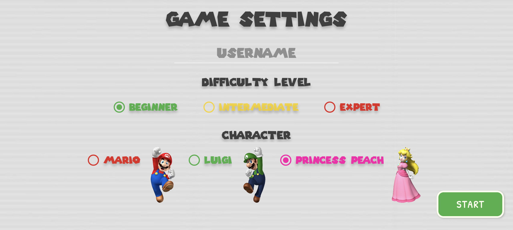
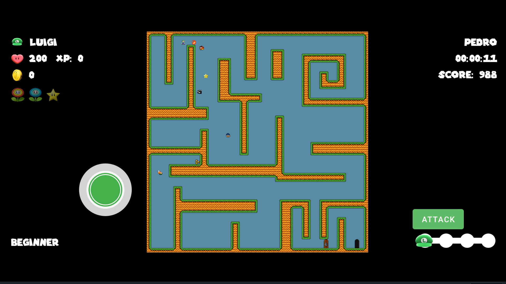
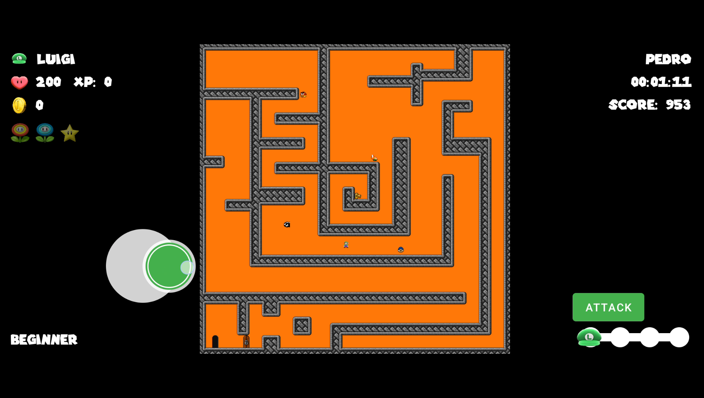
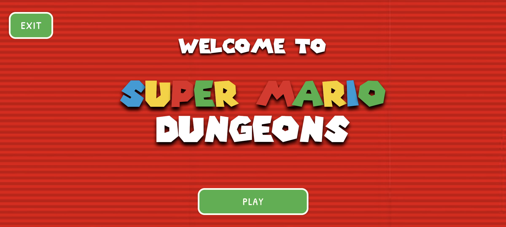

# CS2340C_Team8

# Super Mario Dungeons

Super Mario Dungeons is a Android based mobile game application that allows users to play as 3 different characters (Mario, Luigi, Peach) and traverse through 3 game-themed levels filled with a variety of powerups (Star Power, Ice Power, Fire Power) and enemies (Bullet Bill, Goomba, Koopa Troopa, Pirhana Plant). Each level is a maze course with a end location objective that the user must arrive to. The users final score is based on compeltion time, powerups attained, and enemies destroyed. Get the high score and be put at the top of our leaderboard!

---

## Implemented Design Patterns

- **Model-View-View Model (MVVM) Design**
- **Singleton Design Pattern**
- **Strategy Pattern**
- **Factory Design Pattern**
- **Observer Design Pattern**
- **Decorator Design Pattern**

---

## Screenshots

### 🏠 Home Screen

### 🏃 Player Select Screen

### 🏰 Maze 1

### 🏰 Maze 2

### 🏰 Maze 3

---

## Video Demo

---
